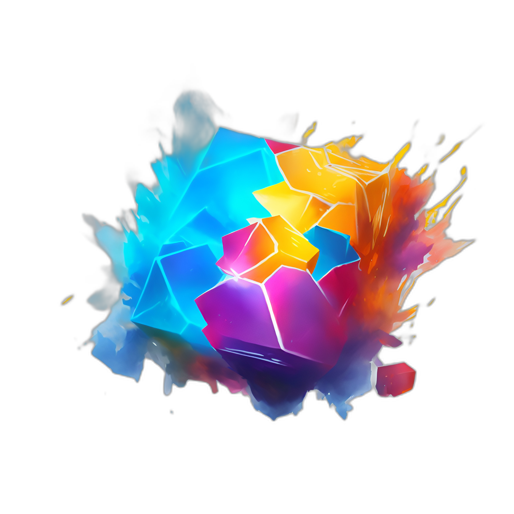

# KVec

Use Cloudflare KV or Upstash Redis with OpenAI/Cohere Text Embedding and Pinecone Vector Database.



## Features

- Support for different item types: KVec supports **text**, **web page**, and **image** items out of the box, and you can easily extend it to support other types.
- Modular architecture: KVec allows you to easily change components like the encoder, object store, and vector store to fit your specific use case.
- Authentication: KVec supports authentication using JWT tokens.
- Dashboard GUI: KVec comes with a simple dashboard that allows you to manage your items and issue authentication tokens.
- RESTful API: KVec provides a simple API for creating, reading, deleting, and searching items.

## Setup

### Cloudflare Pages

To use [Cloudflare Pages](https://pages.cloudflare.com/) to host your KVec.

You should set up the following environment variables:

- `APP_SECRET`: Secret for signing JWT tokens
- `PINECONE_API_KEY`: To enable `PineconeVecStore` (see [Structure](#structure))
- `PINECONE_ENDPOINT`: The endpoint of your Pinecone index, nessary for `PineconeVecStore`
- `OPENAI_API_KEY`: To enable `OpenAIEncoder` (see [Structure](#structure))
- `HF_API_TOKEN`: To enable `BaseTextAdapter`'s image feature

And bind a KV namespace:

- `KV`: KV namespace for storing items, nessary for `CloudflareKVObjStore` (see [Structure](#structure))

> You can simply:
>
> 1. Fork this repo.
> 2. Create a new Cloudflare Pages project, connect to your forked repo, and setup the environment variables.
> 3. Create a KV namespace and bind it to the project.

## GUI

You can use the dashboard GUI to manage items and issue tokens.

You can access the dashboard from `https://kvec.yourdomain.com/`.

## API

### Authentication

You will need to get a JWT token to make requests to the item API.

One way to do this is to use the dashboard GUI.

However, you can also issue tokens using the API itself:

```bash
curl -X POST \
    -H "Content-Type: application/json" \
    -d '{ "secret": "your-app-secret", "exp": 3600, "perm": { "read": true, "write": false } }' \
    https://kvec.yourdomain.com/api/auth
# Creates a token that expires in 1 hour and only allows read access
```

```json
{
    "token": "ISSUED_JWT"
}
```

> The token can be passed in the `Authorization` header of the request or the `kvec_token` cookie.

### Item API

The item API allows you to create, read, delete, and search items.

#### Create an item

`write` permission is required.

```bash
curl -X POST \
    -H "Content-Type: application/json" \
    -H "Authorization: YOUR_TOKEN" \
    -d '{ "data": { text: "the content of the item" } }' \
    https://kvec.yourdomain.com/api/item
```

```json
{
    "id": "ITEM_ID"
}
```

> This will create a new item with the text `the content of the item`.

Examples for other types of items:

> Web page. The `BaseTextAdapter` will automatically fetch and use the page title and description as the page feature.

```json
{
    "data": {
        "page": "https://github.com/JacobLinCool/kvec"
    }
}
```

> Image. `HF_API_TOKEN` environment variable is required.
> It uses Hugging Face's inference API to transform the image into text as the image feature.
> The default model is `nlpconnect/vit-gpt2-image-captioning`, but you can specify a different model by setting the `HF_IMGCAP_MODEL` environment variable.
> `http://`, `https://`, and `data:` are supported.

```json
{
    "data": {
        "img": "https://kvec.pages.dev/icon.png"
    }
}
```

#### Read an item

`read` permission is required.

```bash
curl -X GET \
    -H "Content-Type: application/json" \
    -H "Authorization: YOUR_TOKEN" \
    https://kvec.yourdomain.com/api/item/<ITEM_ID>
```

```json
{
    "item": {
        "id": "ITEM_ID",
        "data": {
            "text": "the content of the item"
        },
        "meta": {
            "type": "text"
        }
    }
}
```

#### Delete an item

`write` permission is required.

```bash
curl -X DELETE \
    -H "Content-Type: application/json" \
    -H "Authorization: YOUR_TOKEN" \
    https://kvec.yourdomain.com/api/item/<ITEM_ID>
```

```json
{
    "deleted": true,
    "item": {
        "id": "ITEM_ID",
        "data": {
            "text": "the content of the item"
        },
        "meta": {
            "type": "text"
        }
    }
}
```

#### Search items

It performs a semantic search to find items that are similar to the query.

`read` permission is required.

```bash
curl -X GET \
    -H "Content-Type: application/json" \
    -H "Authorization: YOUR_TOKEN" \
    https://kvec.yourdomain.com/api/item?q=<QUERY>
```

```json
{
    "items": [
        {
            "id": "ITEM_ID_1",
            "data": {
                "text": "the content of item 1"
            },
            "meta": {
                "type": "text"
            }
        },
        {
            "id": "ITEM_ID_2",
            "data": {
                "text": "the content of item 2",
                "page": "https://example.com/item2"
            },
            "meta": {
                "type": "page"
            }
        },
        {
            "id": "ITEM_ID_3",
            "data": {
                "text": "the content of item 2",
                "img": "https://example.com/item3.png"
            },
            "meta": {
                "type": "img"
            }
        }
    ]
}
```

## Structure

The KVec structure is mainly based on 6 components:

- The **API** and GUI layer, which allows other services to interact with KVec easily and manage the authorizations.
- The **Adapter** layer, which is responsible for adapting the data from the API layer to the encoder layer.
- The **Encoder** layer, which is responsible for encoding the data into vectors (embeddings).
- The **ObjStore** layer, which is responsible for storing the items itself.
- The **VecStore** layer, which is responsible for storing the vectors, and performing the search.
- The **Cache** layer, which is responsible for caching the search results.

The Adapter, Encoder, ObjStore, VecStore, and Cache layers are all pluggable, so you can easily customize them to fit your needs.

Currently, the following implementations are available:

- **Adapter**
  - [x] `BaseTextAdapter`: Support text, web page, and image _(env `HF_API_TOKEN` required)_ items.
- **Encoder**
  - [x] `OpenAIEncoder`: Use [OpenAI's `text-embedding-ada-002`](https://platform.openai.com/docs/guides/embeddings) to create embeddings
  - [x] `CohereEncoder`: Use [Cohere](https://docs.cohere.ai/docs/embeddings) as the embedding service
  - [x] `JustEncoder`: Only for local development
- **ObjStore**
  - [x] `CloudflareKVObjStore`: Use [Cloudflare KV](https://www.cloudflare.com/products/workers-kv/) as the object store backend
  - [x] `UpstashRedisObjStore`: Use [Upstash Redis](https://upstash.com/) as the object store backend
  - [x] `MemoryObjStore`: Only for local development
- **VecStore**
  - [x] `PineconeVecStore`: Use [Pinecone](https://www.pinecone.io/) as the vector store backend
  - [x] `MemoryVecStore`: Only for local development
- **Cache**
  - [x] `CloudflareCache`: Use Cloudflare's Cache API
  - [x] `MemoryCache`: Only for local development, it just "don't cache anything"

> The auto module will automatically load the correct implementation based on the environment variables.
> See [src/lib/server/auto/index.ts](./src/lib/server/auto/index.ts)
